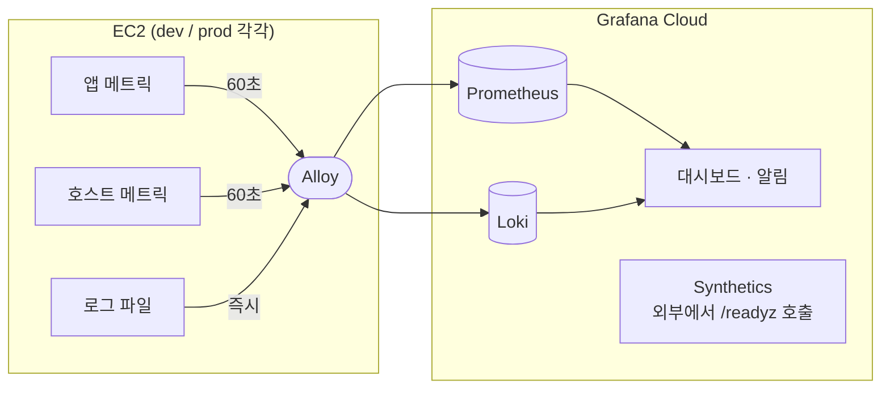

# 모니터링 구성

**모니터링과 알림이 어떻게 짜여 있는지 보는 문서다.** 쿼리나 임계값 같은 세부 설정은 Grafana Cloud 화면에 있고, 이 문서는 무엇을 왜 보는지와 어디를 고치면 되는지만 다룬다. 서버 배포는 [백엔드 배포 가이드](백엔드_배포_가이드.md)에서 다룬다.

---

## 1. 전체 구조



- **앱 지표**는 Spring Actuator가 만들고, **호스트 지표**는 Alloy가 직접 만든다. **로그**는 앱과 MySQL이 파일에 쓰고 Alloy가 읽는다. Alloy가 이것들을 모아 Grafana Cloud로 보낸다.
- 모든 지표와 로그에 `env` 라벨(`dev`/`prod`)이 붙는다. 값은 서버 `.env`의 `SPRING_PROFILES_ACTIVE`를 그대로 쓴다.
- 로그에는 `app` 라벨(`devica-app`/`devica-db`)도 붙어 앱 로그와 MySQL 로그를 구분한다.
- Actuator는 호스트에 열지 않는 관리 포트 8081에 있다. 외부에 열린 헬스체크는 메인 포트의 `/readyz`뿐이며, ALB 헬스체크·배포 검증(`scripts/validate.sh`)·Synthetics가 이 경로를 쓴다.

---

## 2. 구성 요소와 위치

| 구성 요소 | 역할 | 위치 |
|---|---|---|
| Actuator 메트릭 | 앱 지표 노출, 응답시간 버킷 정의 | `application.yml`, `application-{dev,prod}.yml` |
| Alloy | 수집·전송 에이전트 | `monitoring/config.alloy`, `docker-compose.server.yml` |
| 접속 정보 | Grafana Cloud URL·계정·토큰 | 각 서버 `/opt/app/.env` (규격: `.env.server.example`) |
| 대시보드 | `Devica Overview` | Grafana **Dashboards** / 백업: `monitoring/dashboard.json` |
| 로그 파일 | 앱 ECS 로그, MySQL 오류 로그 | 각 서버 `/opt/app/logs/{app,db}` (규칙: [로깅 컨벤션](로깅_컨벤션.md)) |
| 알림 규칙 | 지표 기반 알림 5개, 로그 기반 알림 3개 | Grafana **Alerting → Alert rules** → `Devica` 폴더 |
| 외부 헬스체크 | prod `/readyz` 호출과 실패 알림 | Grafana **Testing & synthetics → Synthetics** → `devica-readyz` |
| 알림 수신처 | 이메일 | Grafana **Alerting → Contact points**, **Notification policies** |

---

## 3. 수집하는 지표와 로그

서비스 특성에서 출발해 골랐다. 읽기 전용 API에 외부 호출이 없으므로 장애 원인은 앱·DB·호스트 셋 중 하나이고, 앱과 DB가 2GB 서버 한 대에 있어 메모리가 가장 유력한 원인이다.

| 구분 | 지표 | 출처 |
|---|---|---|
| 요청 (RED) | 경로별 요청 수, 상태코드(5xx·4xx), 응답시간 분포 | Actuator |
| 앱 내부 | 힙 사용량, GC 멈춤 시간, DB 커넥션 사용·대기 | Actuator |
| 호스트 (USE) | 사용 가능한 메모리, swap in/out, 디스크 사용률, CPU | Alloy |
| 가용성 | 외부에서 본 `/readyz` 성공 여부 | Synthetics |
| 수집 상태 | 보내지 못하고 버린 로그 수 (`loki_write_dropped_entries_total`) | Alloy |
| 로그 | 앱 ECS 로그(요청 로그, 예외 로그), MySQL 오류 로그 | 앱·MySQL → Alloy |

- **응답시간은 버킷(100ms~5s)으로 수집한다.** 알림 기준은 버킷 경계 중에서 골라야 정확히 계산된다.
- **수집 간격은 60초다.** 요금이 series당 분당 데이터 1개 기준이다.
- **ALB 헬스체크(`/readyz`)는 대시보드·알림의 요청 집계에서 뺀다.** 30초마다 들어와 실제 사용량을 가린다.
- **Alloy가 자기 상태에 대해 내는 지표 중에서는 "전송하지 못하고 버린 로그 수"만 수집한다.** 메트릭은 정상인데 로그만 버려지는 경우를 알림으로 잡는 데 쓴다.
- **수집하지 않는 것**: 트레이스, MySQL 내부 지표, CPU 크레딧(CloudWatch 연동 필요).

---

## 4. 대시보드

위에서 아래로 **증상 → 원인** 순서로 배치했다. 상단 `Env` 드롭다운으로 dev와 prod를 전환한다.

| 행 | 보는 것 |
|---|---|
| Overview | 수집 상태, 최근 5xx, p95, 사용 가능한 메모리 |
| Requests (RED) | 경로별 요청 수·p95, 상태코드별 요청 수 |
| Host (USE) | 메모리, swap, 디스크, CPU |
| JVM / DB | 힙, GC, DB 커넥션 |
| Logs | 로그 수집 상태, 예외 종류별 추이, 4xx 원인별 개수, 1초 넘은 요청, ERROR·DB 로그 원문, `trace.id` 로 요청 하나 찾기 |

Logs 행은 메트릭이 답하지 못하는 "어떤 예외 때문인지, 어느 요청이었는지"를 본다. 상단 `Trace ID` 입력칸에 응답 헤더 `X-Trace-Id` 값을 넣으면 Trace Lookup 패널에 그 요청의 로그가 나온다.

### 로그 조회

대시보드에 없는 조건은 Grafana **Explore**에서 Loki 데이터 소스를 골라 LogQL로 찾는다. 앱 로그는 ECS JSON이라 `| json`으로 필드를 꺼내 거른다. 필드 이름의 점(`.`)은 밑줄(`_`)로 바뀐다.

```
{env="prod", app="devica-app"} | json | trace_id="<X-Trace-Id 값>"
{env="prod", app="devica-app"} | json | log_level="ERROR"
{env="prod", app="devica-app"} | json | error_code="ANSWER_NOT_ALLOWED"
{env="prod", app="devica-app"} | json | http_route="/api/faqs/{slug}"
```

---

## 5. 알림

**prod에만 건다.** dev는 배포·재시작이 잦아 잡음만 생긴다.

| 알림 | 잡는 상황 | 기준 (요약) | 등급 |
|---|---|---|---|
| App Down | 앱 수집 실패, 서버 전체 다운, **Alloy 다운** | 3분 지속, 데이터 없음도 알림 | critical |
| 5xx Errors | 서버 결함 | 5분간 3건 이상 | critical |
| High Latency | 응답 지연 | 1초 초과 요청 10% 초과 (요청 10건 이상일 때만) | warning |
| Low Memory | 메모리 고갈 | 200MB 미만 5분 지속 | critical |
| Disk Almost Full | 디스크 고갈 | 80% 초과 30분 지속 | warning |
| Synthetics (per-check) | 도메인·ALB·인증서 포함 사용자 경로 전체 | 5분간 10회 중 6회 실패 | - |
| Log Delivery Failed | 로그만 버려짐 (메트릭은 정상이라 App Down 이 울리지 않는 경우) | 버린 로그 수가 5분간 1건 이상 증가 | warning |
| Client-Server Mismatch | 배포 후 프론트엔드와 서버의 질문 데이터 불일치 | `ANSWER_NOT_ALLOWED`·`QUESTION_NOT_FOUND` 10분간 3건 이상 | warning |
| DB Error Log | MySQL 자체 오류 (디스크 부족, 비정상 종료 후 복구 등) | MySQL 오류 로그에 `[ERROR]` 5분간 1건 이상 | critical |

규칙에 공통으로 적용한 원칙이다.

- **울리면 바로 할 일이 있는 것만 건다.** 4xx는 봇 스캔과 섞여 알림에서 뺐고 대시보드에서만 본다.
- **트래픽이 적어 비율보다 건수로 건다.** 비율을 쓸 때는 최소 요청 수 조건을 붙인다.
- **처리하지 못한 예외(ERROR 로그)는 따로 알리지 않는다.** 곧 5xx라 5xx Errors 와 같은 사건으로 알림이 겹친다. 원인은 대시보드의 Logs 행에서 본다.
- **"데이터 없음"은 App Down만 알림으로 본다.** 나머지는 정상으로 둬 같은 원인으로 알림이 겹치지 않게 한다.
- **데이터가 끊긴 뒤 "없음"으로 판정되기까지 최대 5분 걸린다.** 서버 다운은 Synthetics가 먼저 알린다.

---

## 6. 바꾸고 싶을 때

| 하고 싶은 일 | 고칠 곳 | 배포 필요 |
|---|---|---|
| 알림 추가, 기준값 변경 | Grafana Alert rules | 아니오 |
| 응답시간 기준을 버킷에 없는 값으로 | `application.yml`의 버킷 경계 | 예 |
| 앱에서 새 지표 만들기 | Micrometer로 코드에서 등록 → 자동 노출 | 예 |
| 호스트 지표 추가 | `monitoring/config.alloy`의 수집기 목록 | 예 |
| 수집할 로그 파일 추가 | `config.alloy`의 `local.file_match` 경로와 `docker-compose.server.yml`의 마운트 | 예 |
| 대시보드 수정 | Grafana에서 고친 뒤 JSON으로 내보내 `monitoring/dashboard.json` 갱신 | 아니오 |
| 수신처 변경·추가 | Grafana Contact points | 아니오 |

`config.alloy`는 배포할 때 서버로 복사되고 Alloy가 재시작되어 반영된다(`scripts/deploy.sh`).

---

## 7. 알아둘 제약

- **무료 플랜 한도**: 메트릭 series 1만 개, series당 분당 데이터 1개. 지표나 라벨을 늘리기 전에 현재 series 수를 확인한다.
- **이메일은 Grafana 조직 멤버에게만 보낼 수 있다.** 받을 사람을 조직에 먼저 초대한다.
- **Slack은 보류했다.** 우테코 워크스페이스가 앱 설치 한도에 걸려 있다. 가능해지면 Contact point만 바꾸면 되고 규칙은 그대로 둔다.
